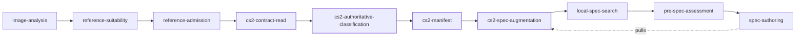

# plugin-cs2

Counter-Strike 2 weapon and glove skin reconstruction, as an [img2threejs](https://github.com/img2threejs/img2threejs)
plugin.

Without this plugin the base skill treats a CS2 skin as an ordinary hard-surface object and
reconstructs it by inference — which works, and is less exact. With it, the run gains an authoritative
intake contract, a machine-checked manifest, the finish and wear rulebook, and a blocking review gate:
none of which the base skill can improvise.

The base skill stays the entry point. **This plugin cannot run alone.**

## Install

```bash
img2 add img2threejs/plugin-cs2
img2 doctor                       # expect: ok (N plugins, 0 warnings)
```

Requires harness `>=0.2.1` and `coreApi 1`. Python 3.10+, standard library only for the required path.

## Use

Declare the domain on the state file:

```bash
--profile cs2
```

**It is never inferred from the target's name.** A target called `"AK-47 | Redline"` does not
self-identify, by design — name similarity is not evidence (`PLUGIN_CONTRACT.md` §13). The base skill
previously applied CS2's quality floors to anything whose name contained one of seventeen keywords,
`"fade"` among them, which is the failure this rule exists to prevent.

There is no `--cs2` flag. The base pulls this plugin's augmentation automatically once the domain
resolves.

## What it contributes

Four setup steps spliced immediately **before** the base's `local-spec-search`, and one blocking gate
before `ai-review-recorded` in **every** correction pass.

| Step | Actor | What it does |
|---|---|---|
| `cs2-contract-read` | agent | Read `grimoire/intake/cs2_intake_contract.md` **completely** before creating or validating the manifest. It is a contract, not a reference. |
| `cs2-authoritative-classification` | agent | Obtain an authoritative family/subtype record into `classification.json`. Guessing the subtype from the image is the failure this step exists to prevent. |
| `cs2-manifest` | program | Builds and validates `cs2-intake.json`. Records `componentAdapter` when this plugin has geometry for the family, or `geometrySource: agent-inferred` when it does not. |
| `cs2-spec-augmentation` | program | Emits `spec-augmentation.json` — the artifact the base **pulls** during spec authoring. |
| `cs2-review` | gate | Machine-readable verdict. **Blocking**: a failed verdict stops `continue` even when the global fidelity score passes. |

It also contributes the `cs2` evidence collection to the base's local spec search.



## Hard rules

- **Read the intake contract completely before the manifest.** A manifest authored without it is not
  admissible.
- **A failed `cs2-review` blocks continuation.** Do not proceed on a global score alone. The review is
  deliberately stricter than the general fidelity gate, because a wrong subtype or a wrong finish reads
  as a different item entirely.
- **Paint seed and float are not recoverable from an image.** Record pattern placement and wear as
  approximated, never as measured.
- **The subtype is authoritative or it is unknown.** A Talon has no crossguard; a Karambit does.
  Reporting a part as not-applicable is correct; inventing one is not.

## What ships

```
plugin.json                 typed capability edge: image -> cs2-skin-spec
domain.json                 the 4 setup steps, 1 pass step, their anchors, the corpus name
gates.json                  the blocking cs2-review gate
steps.json                  harness-level step rows
spec_search_profile.json    the cs2 evidence collection
SKILL.md                    what the model is told about this domain

grimoire/intake/            the intake contract, quality and identity, technical analysis,
                            texture acquisition
grimoire/build/             finish routes and the wear rulebook
docs/cs2/                   technical mapping and vocabulary
docs/cs2-anatomy/           per-family anatomy: knives, gloves, pistols, rifles, SMGs,
                            snipers, heavy
docs/specs/vocabulary/      distilled vocabulary records the corpus indexes
skills/                     per-subtype notes
```

### Tools

| Tool | Required? | What it does |
|---|---|---|
| `cs2_manifest.py` | yes | Builds and validates `cs2-intake.json` |
| `cs2_review.py` | yes | The blocking review gate |
| `emit_spec_augmentation.py` | yes | Emits the artifact the base pulls |
| `cs2_spec_template.py` | yes | The finish, material and component recipe |
| `cs2_adapters.py` | yes | Per-family geometry adapters |
| `cs2_foundation.py` | yes | Identity resolution: explicit → resolved → classification |
| `cs2_review_contract.py` | yes | Review scene and the golden thresholds |
| `detect_cs2.py` | no | Heuristic detection, for triage only — never for routing |
| `locate_cs2_vpk.py` | no | Finds a local CS2 install's `pak01_dir.vpk` |
| `extract_cs2_textures.py` | no | Extracts authored paint textures from **your own** install |
| `fetch_cs2_metadata.py` | no | Resolves paint index, float range, rarity from the CSGO-API index |

The optional four are **exactness upgrades**. Every one degrades gracefully: a missing VPK, a missing
extractor binary, a subprocess error or a non-zero exit all return `{"status": "fallback", "reason": …}`
so the pipeline falls back to the image-only path rather than producing a wrong answer. See
[SECURITY.md](SECURITY.md) before using them.

### Geometry coverage

| Family | Adapter | Subtypes |
|---|---|---|
| knife | yes | karambit, butterfly, bayonet, m9, flip, gut, falchion, bowie, navaja, talon, classic |
| pistol | yes | glock-18 |
| rifle, SMG, sniper, heavy, gloves | no | reconstructed as `geometrySource: agent-inferred`, using the anatomy pages in `docs/cs2-anatomy/` |

A family without an adapter is **not** unsupported — it records its geometry source honestly and the
rest of the contract still applies.

## Customising it

Everything below is a change to *this* repo. None of it can weaken the base skill: the augmentation
merge is raise-only, and a plugin cannot remove a base gate.

### Add a subtype to a family that already has an adapter

`tools/cs2_adapters.py` → add to `SUPPORTED_KNIFE_SUBTYPES` (or the pistol set). Add its anatomy to
`docs/cs2-anatomy/<family>.md` in the same shape as the existing entries — the anatomy page is what
tells the run which parts a subtype does and does not have, and "not applicable" is a valid answer.

### Add a whole new family adapter

`tools/cs2_adapters.py` → build a `FamilyAdapter` (topology, painted regions, material assignments,
feature targets, attachment rules, review viewpoints) and register it in `_ADAPTERS`. Until you do, the
family falls back to `agent-inferred`, which is a working path — so do this when inference is
measurably not good enough, not preemptively.

### Tune the review thresholds

`tools/cs2_review_contract.py` → `GOLDEN_THRESHOLDS`:

```python
silhouetteIoU 0.85 · aspectRatioDelta 0.05 · scaleDelta 0.08
paintedRegionMask 0.85 · colorRegion 0.80 · patternRegion 0.75 · wearRegion 0.70
```

Two things to know before you touch these. **Raising a threshold is safe; lowering one is a real
loosening** of the only domain gate in the run. And the oracle replay
(`tests/test_cs2_oracle_replay.py`) asserts byte equality against a completed reconstruction — any
threshold change fails it, deliberately. Re-freeze the fixture only when you can say why the new
verdict is the correct one.

### Change where the steps land in the pipeline

`domain.json` → `setupAnchorBefore` and `passAnchorBefore` name **base** step ids, and your steps
splice immediately before them. The current anchors are chosen so the manifest can read
`admission.json` and `probe.json` (which exist after `reference-admission`) and so `spec-authoring` can
pull `spec-augmentation.json`. An anchor naming a base step that does not exist fails loud rather than
appending at the end.

### Change what the augmentation raises

`tools/emit_spec_augmentation.py`. The merge is executed by base code and is **raise-only**: a number
below the base value is clamped and the attempt recorded; a looser strictness tier is ignored; an
unknown key is refused. You cannot lower a base floor from here, by design.

### Add reference material to the corpus

Drop it under `docs/cs2/` or `docs/cs2-anatomy/` — both are already `optional_source_roots` in
`spec_search_profile.json`. Distilled records go in `docs/specs/vocabulary/*.jsonl`.

## Tests

```bash
python3 -m pytest tests -q                              # 36 passed
python3 -m unittest discover -s tests -p 'test_*.py'    # same suite, stdlib runner
```

The suite runs **standalone** — it does not need the base skill's test tree. It includes
`test_cs2_oracle_replay.py`, a byte-equality replay of a completed Talon reconstruction
(`tests/fixtures/oracle-talon/`) that fails if the review output drifts by a single byte, and
`test_suite_integrity.py`, which asserts the collected count against a recorded floor — a single
indentation error once silently dropped three tests here, and only counting caught it.

## Limits

- Paint seed and float **cannot** be recovered from an image. They are approximated and must be
  reported as such.
- `detect_cs2.py` is a heuristic for triage. Routing is by declared domain, never by detection.
- The optional exactness tools need your own legal CS2 install and, for texture extraction, a
  Source2Viewer-CLI binary you supply.

## License

Apache-2.0 — see [LICENSE](LICENSE).

Counter-Strike 2 and all related marks and assets are the property of Valve Corporation. This plugin
ships **no** game assets; see [SECURITY.md](SECURITY.md).
