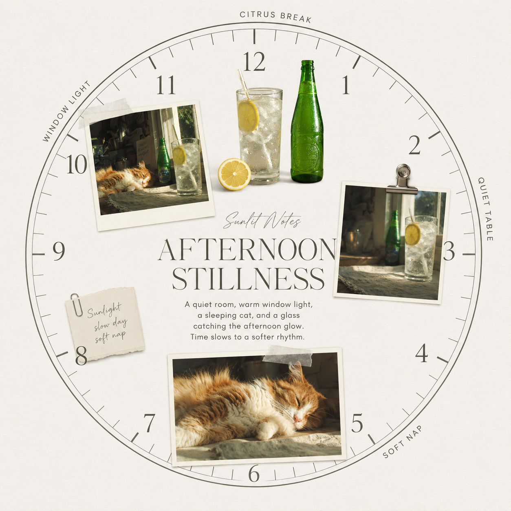
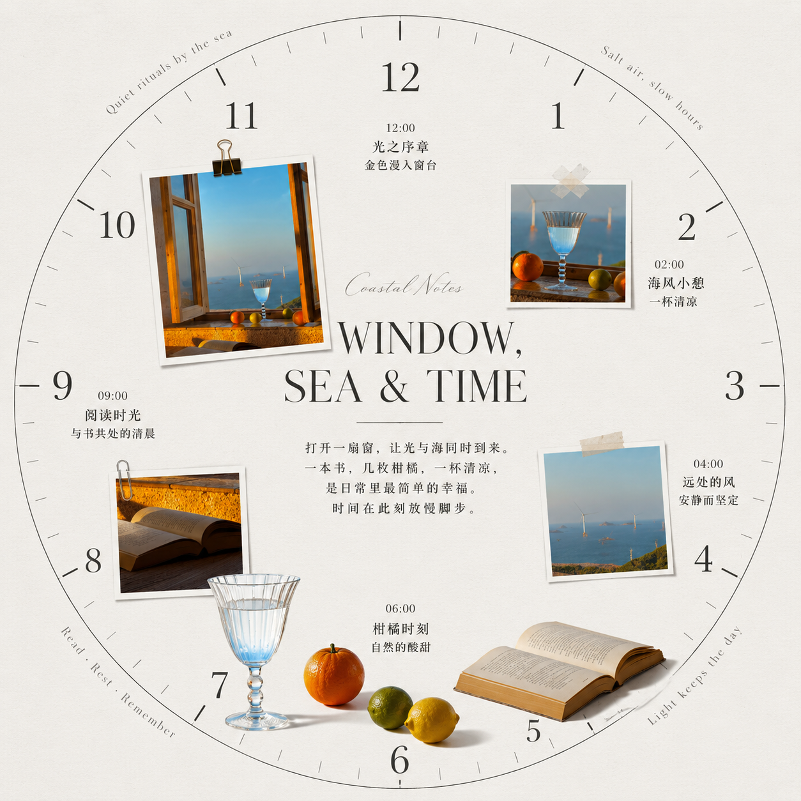
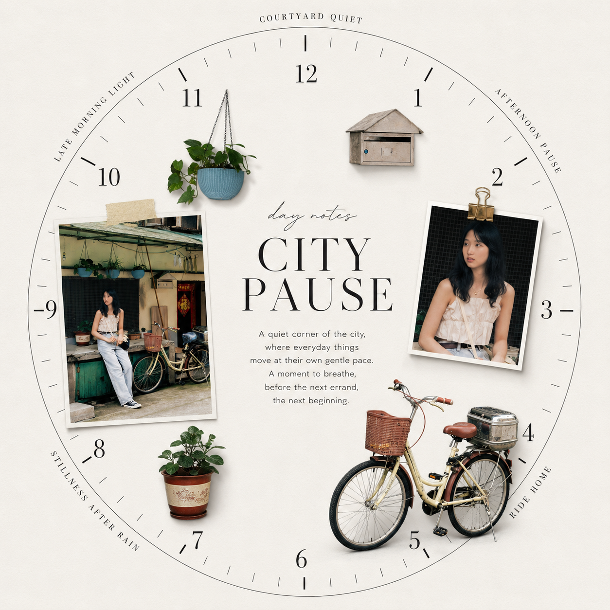
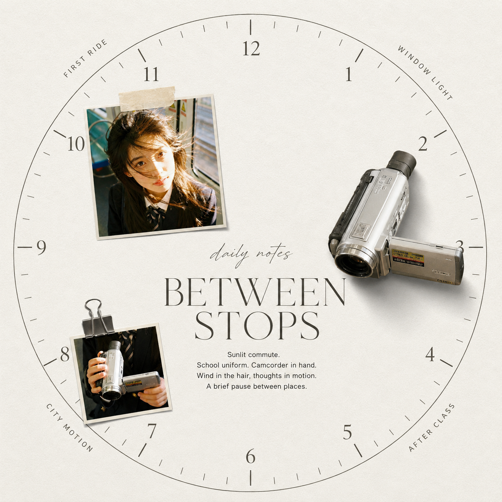
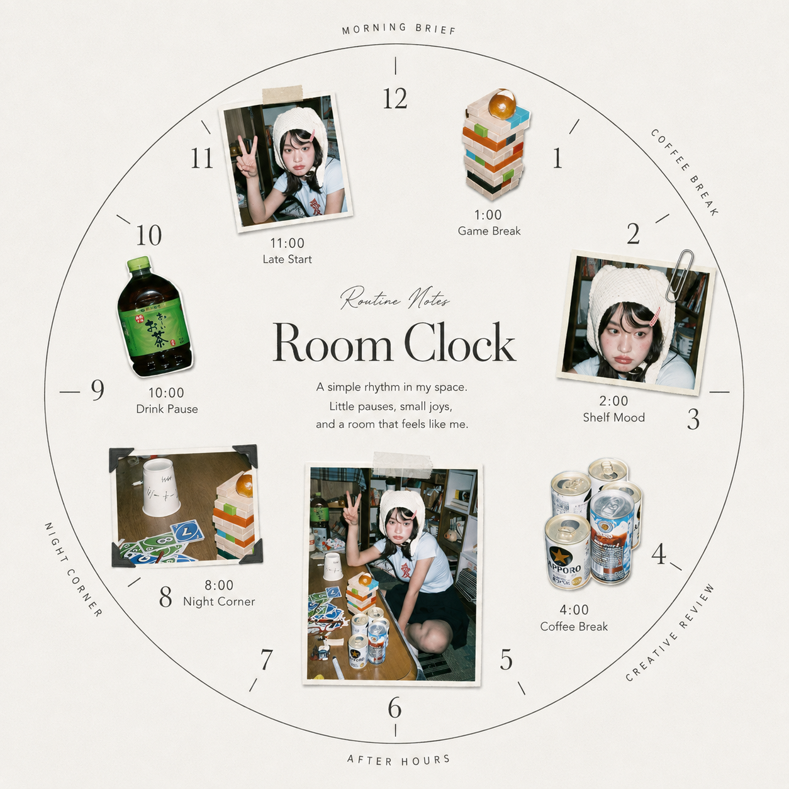
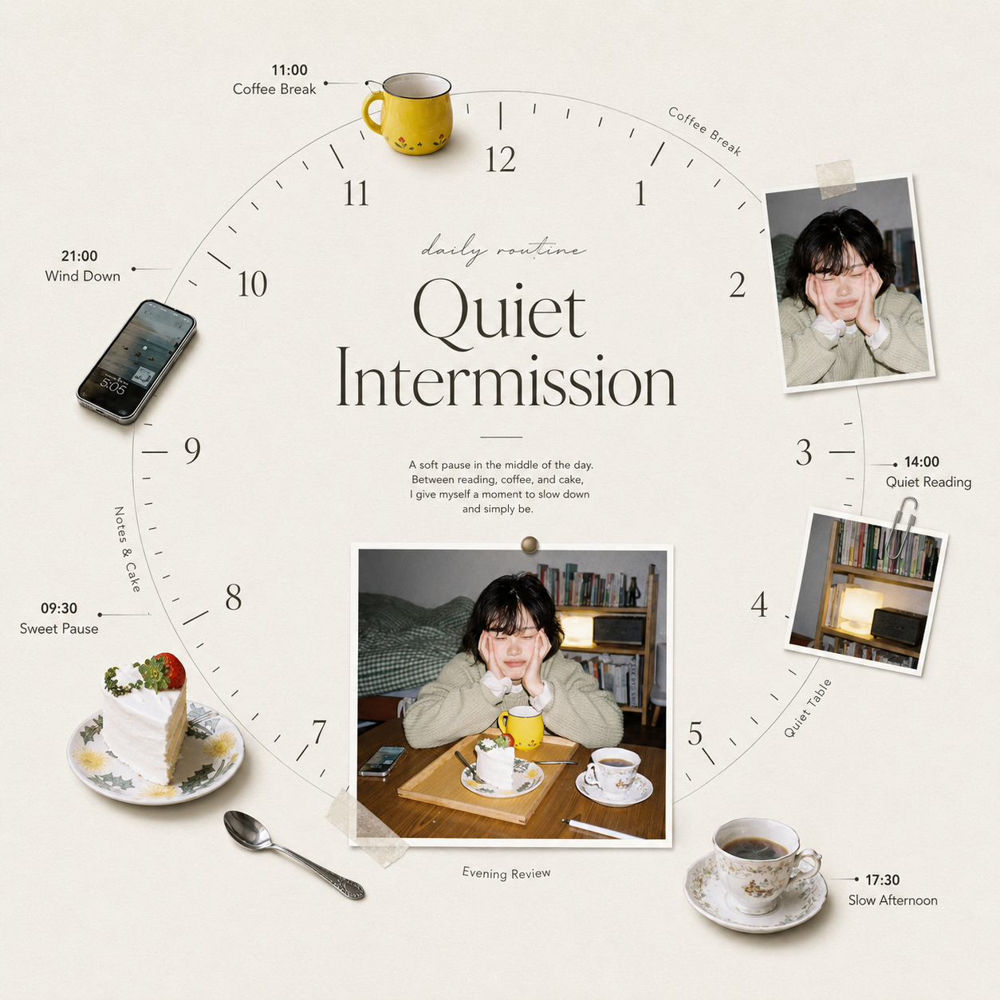

# LSF 时钟式 Editorial 海报生成器

一个用于 Codex 的图像生成 Skill。它会分析用户上传的照片，精选人物照片与完整真实物件，并以绝对正圆、无指针的时钟作为时间排版坐标系，生成高级生活方式杂志风格的 Editorial 海报。

## 效果展示

<table>
  <tr>
    <td></td>
    <td></td>
  </tr>
  <tr>
    <td></td>
    <td></td>
  </tr>
  <tr>
    <td></td>
    <td></td>
  </tr>
</table>

## 主要特性

- 自动分析照片，变量留空时不追问
- 时钟保持标准几何正圆，完整呈现 1–12 数字和长短刻度
- 禁止时针、分针和秒针
- 人物身份、服装、发型与肤色忠实原图
- 只提取轮廓完整的真实物件
- 冷中性 `#F3F0EB` 纸张背景
- 照片、物件和文字严格映射到时间节点
- 最终只输出生成完成的海报图片

## 安装

将仓库克隆到 Codex 技能目录：

```powershell
git clone https://github.com/leishifu666/lsf-clock-editorial-poster.git "$env:USERPROFILE\.codex\skills\lsf-clock-editorial-poster"
```

重新打开 Codex 后即可使用：

```text
$lsf-clock-editorial-poster
```

上传照片后，也可以填写以下可选变量：

```text
【主题】=
【主体信息】=
【文案语言】=
【额外要求】=
【图片比例】=
```

完整行为与生成约束见 [`SKILL.md`](SKILL.md)。

## 许可证

[MIT](LICENSE)
