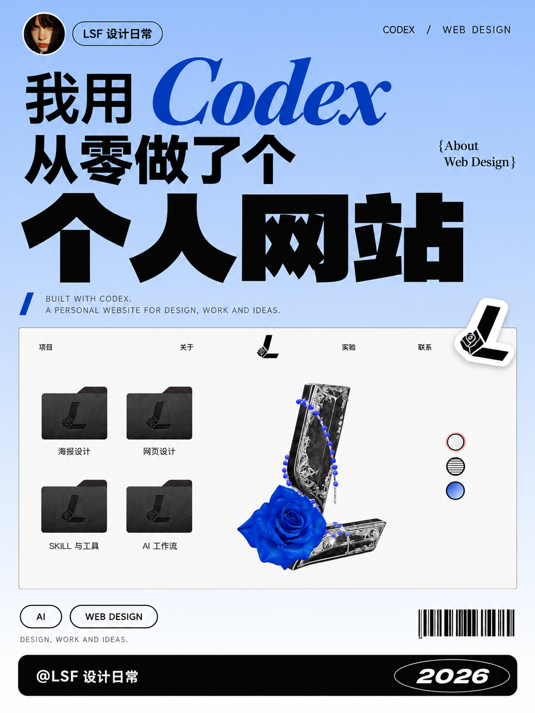
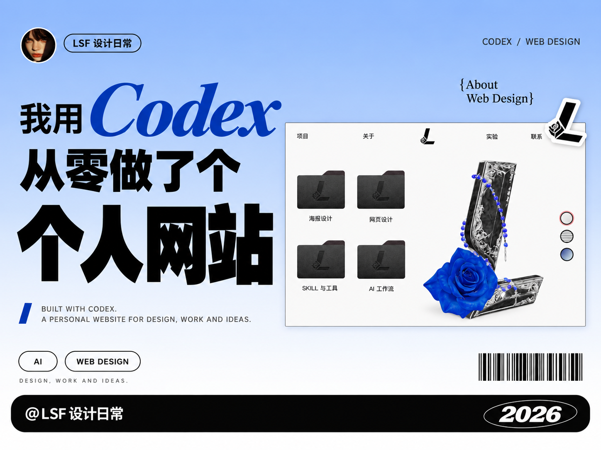
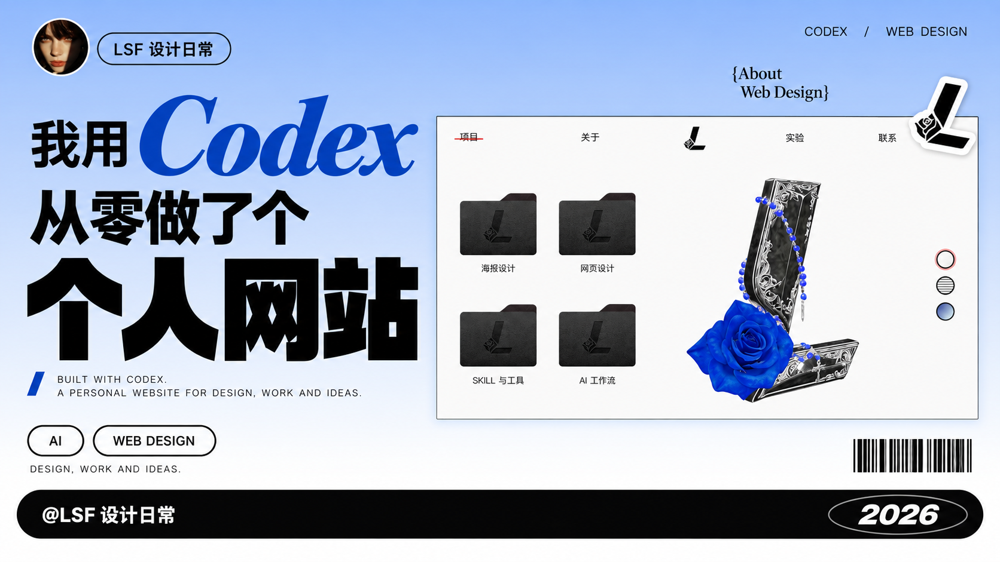
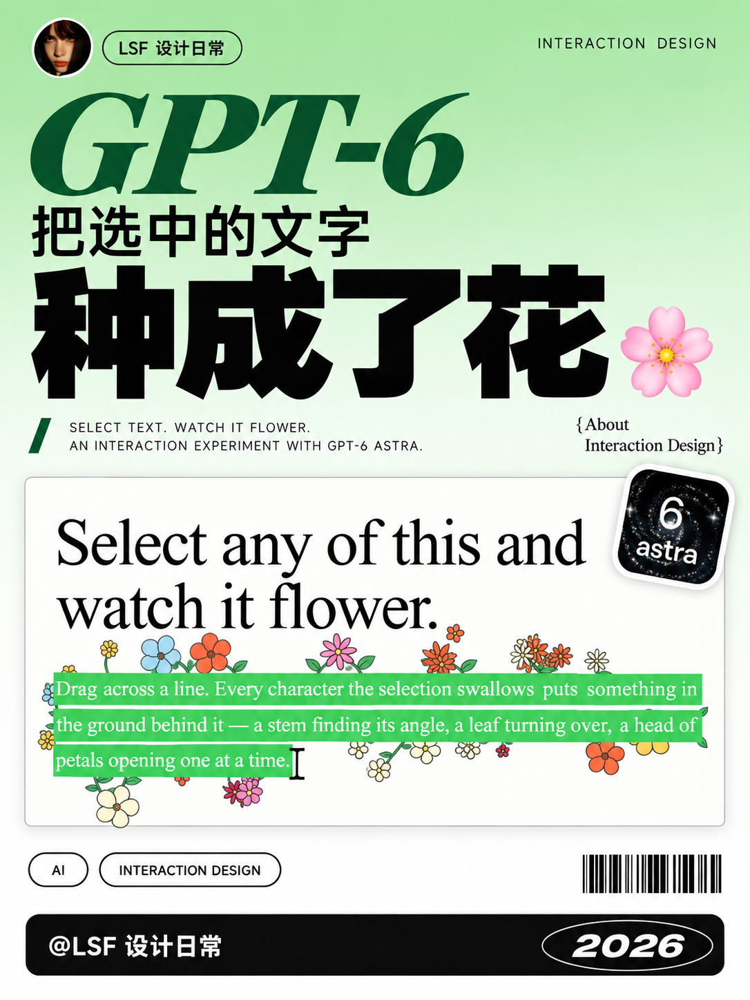
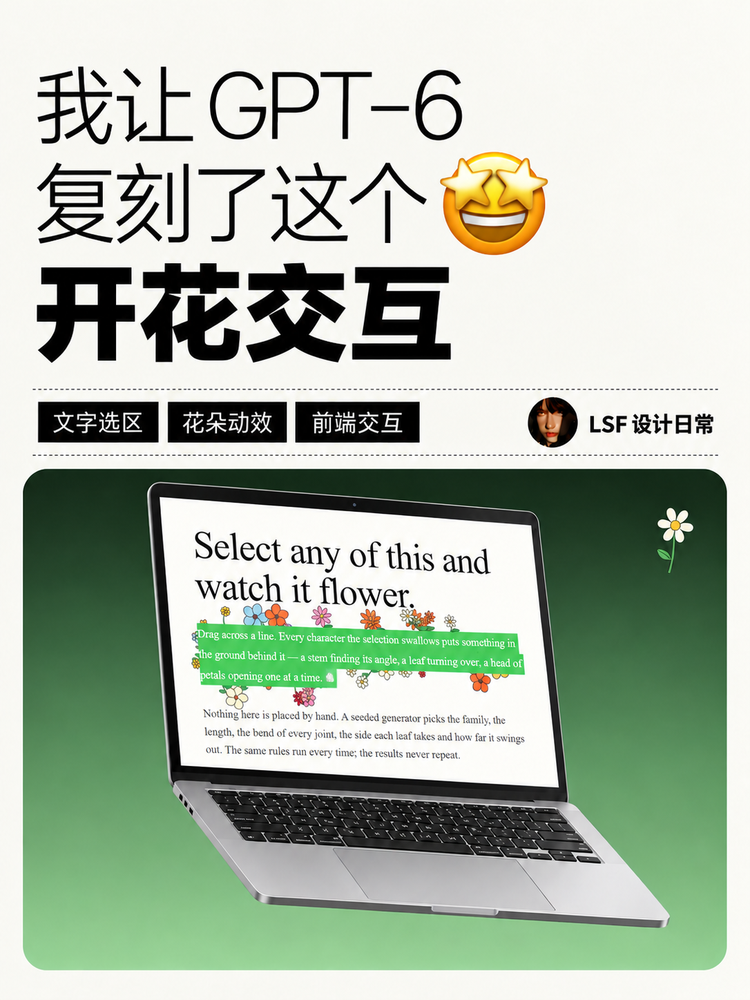
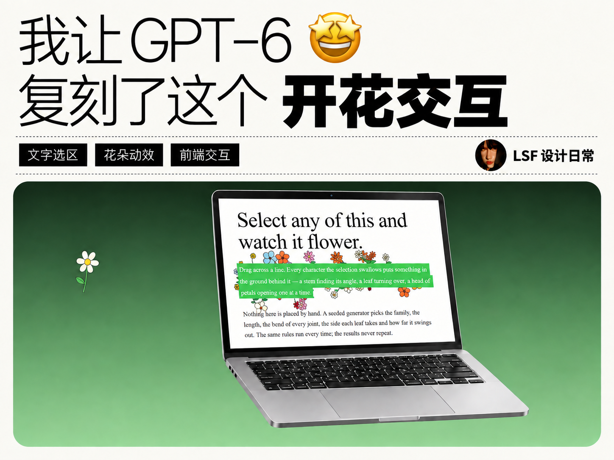
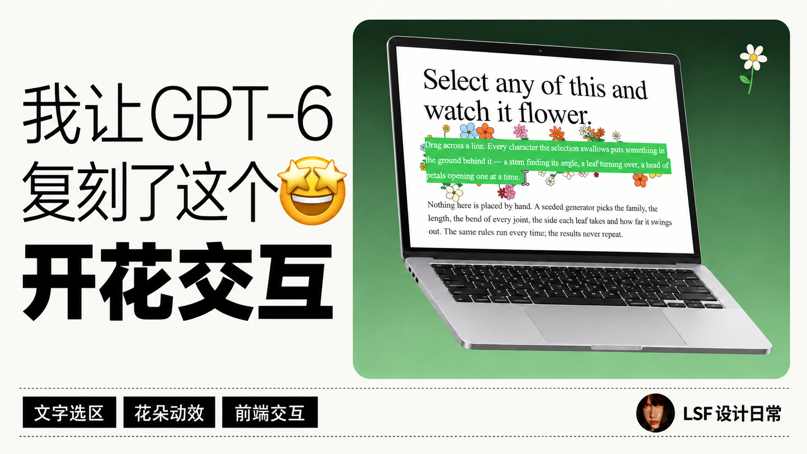

# LSF 封面与社交卡片

**用真实内容制作封面与连续图文。** 支持视频封面、文章封面、连续社交卡片三种模式；可选 AI 教程、设计分享与极简作品海报三种风格。显示名更新为“LSF 封面与社交卡片”，已有 `$lsf-oil-cover` 调用和本地资料继续使用。

> **这是二次开发项目。** 基于 [@oil-oil（oil 欧呦）](https://github.com/oil-oil) 的 [oil-cover](https://github.com/oil-oil/oil-cover)，感谢原作者提供视频选帧、真实界面证据、标题锁定和多画幅生成流程。二次开发与设计分享风格：[LSF 设计日常 / @leishifu666](https://github.com/leishifu666)。本项目保留原作者署名与 MIT 许可，不代表原作者背书。

## 三种交付模式

| 模式 | 输入与用途 | 输出 |
| --- | --- | --- |
| 视频封面 | 视频、字幕与真实操作截图 | 推荐 3:4、4:3、16:9，确认后生成；指定单幅只做该幅 |
| 文章封面 | 全文、标题与用户选定的作品图 | 先确认平台/位置与比例，再制作；2.35:1 宽版可作为候选 |
| 连续社交卡片 | 文章或教程、已选封面与案例图 | 确认文章、主标题、平台、比例、风格和页数后制作，含预览、提示词与压缩包 |

可以直接说“做公众号封面”“把这篇文章按封面风格做成小红书教程图”“制作连续社交媒体卡片”。模式决定交付，风格决定视觉；卡片不会每页生成视频三画幅。

完整流程见 [文章封面](references/article-cover.md) 和 [连续社交卡片](references/social-cards.md)。


## 三种风格，按你的选择制作

| | AI 教程 · 原版风格 | 设计分享 · LSF 扩展 | 极简作品海报 · LSF 扩展 |
| --- | --- | --- | --- |
| 适合 | 工具教学、操作演示、AI 工作流 | 作品集、网页设计、视觉作品与创作分享 | 作品成果、网页交互与设计实测 |
| 视觉 | 清爽产品视觉、真实界面、网格与轻透视 | 标题主次对比、单色渐变、正面作品展示 | 暖白大字、按标题选表情、悬浮 MacBook、主题色单向渐变 |
| 个人标识 | 无人物，或原版可选右下角头像 | 左上角圆形头像、作者名、底部账号和年份 | 信息带附近的圆形头像紧邻作者名 |
| Logo | 产品识别与界面证据 | 截图右上角的 Logo 贴纸 | 保留真实作品识别，不冒充作者标识 |
| 执行方式 | Agent 自主模式 / 原版 API 脚本 | Agent 自主模式与内置图像工具 | Agent 自主模式与内置图像工具 |

视频封面、文章封面和连续卡片都先确定本次内容与主标题，再确认平台、比例和风格。连续卡片还要明确采用的文章版本及页数。已有本次或同组明确选择直接沿用，只补缺项；风格与比例推荐不能替代你的选择。全部确认后才生成，包括试稿。主标题锁定文字，不反复问。

### AI 教程风格效果

以下示例来自上游 [oil-cover](https://github.com/oil-oil/oil-cover)，作者 [@oil-oil](https://github.com/oil-oil)。

<p align="center"></p>
<p align="center"></p>

### 设计分享风格效果

以下是同一条个人网站视频生成的三种构图，展示标题里的字体、字重和颜色对比，以及圆形头像、Logo 贴纸、主题注释和账号署名。

<p align="center"></p>
<p align="center"></p>
<p align="center"></p>

示例为内置图像工具的实际输出：1086×1448、1448×1086、1672×941（最后一张接近 16:9，未本地裁切）。效果图中的账号、头像与网站属于案例作者，安装后不会成为你的默认资料。

### 设计分享案例：GPT-6 把选中的文字种成了花

根据 [LSF 设计日常的原视频](https://www.xiaohongshu.com/explore/6aacae260000000011037fdc) 选取 12 秒处的真实画面：拖选文字时，绿色选区周围长出花朵。封面放大选区、花朵和光标，以绿色到白色的单色渐变呼应作品；“种成了花”使用超粗黑体，“GPT-6”使用深绿衬线斜体，说明文字采用较细字重。

截图右上角的贴纸参考 [OpenAI 官方 GPT-6 Astra 模型页](https://developers.openai.com/api/docs/models/gpt-6-astra) 的图标。标题、截图、图标和作者头像均由内置图像工具参考素材整图生成，细节会被重绘；本案例不代表官方合作或背书。

<p align="center"></p>
<p align="center"></p>
<p align="center"></p>

实际尺寸：1086×1448、1448×1086、1672×941（近似 16:9，未本地裁切）。作者资料仅用于经授权展示的案例成品，不作为安装后的默认资料。

### 新增风格：极简作品海报

案例主标题为“我让 GPT-6 复刻了这个开花交互”。细字与特粗“开花交互”形成对比，🤩 表达看到复刻成果的惊喜；屏幕保留真实绿色选区与花朵，背景由深绿向叶绿单向渐变，头像紧邻作者名。表情和主题色都根据本期内容选择，不固定套用上一期。

三张分别生成：3:4 为上方标题、下方悬浮 MacBook；4:3 为两行宽标题与宽主图；16:9 为左标题、右主图、底部信息带。

<p align="center"></p>
<p align="center"></p>
<p align="center"></p>

实际尺寸：1086×1448、1448×1086、1672×941（近似 16:9，未本地裁切）。细小屏幕文字由图像工具重绘，案例中的账号与头像不会成为安装后的默认资料。完整规则见 [极简作品海报预设](references/minimal-showcase-cover.md)。

## 安装与调用

```bash
npx skills add leishifu666/lsf-oil-cover
```

或把本仓库放入宿主支持的 Skills 目录，确保能读取根目录的 `SKILL.md`。在支持 `$skill-name` 的宿主中调用：

```text
用 $lsf-oil-cover 给这个视频做封面。
```

也可以直接指定：

```text
用 $lsf-oil-cover 做设计分享风格，发小红书。
标题：我用 Codex 从零做了个个人网站。
生成 3:4、4:3、16:9 三版。
```

## 文章封面与连续教程图

```text
用 $lsf-oil-cover 给这篇文章做公众号封面。
沿用已确认标题，使用极简作品海报风格。
主图用我选的作品总览，做一张 2.35:1 宽版。
```

```text
用 $lsf-oil-cover，把这篇文章按已选封面的风格做成 9 张小红书教程图。
每张 3:4，保留真实案例与修改过程。
每页检查，长原版提示词另附文本，交付有序成品、预览和压缩包。
```

连续卡片先确认文章、主标题、平台、比例、风格和页数，再读全文、整理案例、拆页写文案。首页使用本次确认的主标题与风格；内页减小标题，扩大正文与证据区，不重复塞入大设备和头像。九页教程可以按成果、区别、入口、探索、规则、案例、修改、检查、交付展开，页数与章节按实际内容调整。

生成后逐页检查全图和手机缩略图。原图、重建与差异对照要核对真实源图；失败只修改该页。完整原版提示词与压缩示例分别交付，实际尺寸按文件记录。需要发布配套时，再提供标题、正文和标签；不自动上传或发布。

## 第一次使用设计风格：保存你的资料

新风格可直接指定：“用 $lsf-oil-cover 做极简作品海报风格”。

设计分享与极简作品海报共用作者资料管理。平台与资料已知时直接复用；未知时收集该平台的**账号名称和头像图片**。你可以分别提供小红书、公众号、抖音、B 站等平台资料，也可以明确让几个平台共用一套。

- 同个平台已保存完整资料时，直接复用，不再反复问名字或头像。
- 头像原图复制到本机资料目录，聊天临时图片清理后仍可使用。
- 平台之间独立保存，更换公众号头像不会影响小红书。
- 默认底部署名为 `@账号名称`；公众号等可以设置不带 @ 的自定义署名。
- 资料只存本机，不登录社交平台，不发布内容，不写进开源仓库。

默认位置：`~/.lsf-oil-cover/profiles.json` 与 `~/.lsf-oil-cover/avatars/`。可通过 `LSF_OIL_COVER_HOME` 指定其他本机目录；不要放进 Skill 或 Git 仓库。

需要手动管理时，在仓库根目录运行：

```bash
python -m pip install -r requirements.txt
python scripts/creator_profiles.py set --platform xiaohongshu --name "你的账号名称" --avatar "头像.png"
python scripts/creator_profiles.py set --platform wechat --name "你的公众号" --avatar "公众号头像.png" --signature "你的公众号"
python scripts/creator_profiles.py set --platform douyin --name "你的抖音名称" --avatar "抖音头像.png"
python scripts/creator_profiles.py list
python scripts/creator_profiles.py show --platform xiaohongshu
```

名字与头像会被读取并用于本次生成。详细更新方法、中文平台别名与数据格式见 [作者资料说明](references/creator-profiles.md)。

## 设计分享风格的设计规则

- **标题有重点**：先区分结果、工具、说明词；用字体、粗细、字号或颜色建立主次，不把每个词都做成同样的超粗黑字。
- **单色渐变**：一个纯色逐渐过渡到白色；深色截图可过渡到黑色。中间不混入第二种彩色，也不加网格或光斑。
- **作者与作品分开**：左上角圆形头像＋作者名，截图右上角为作品或产品 Logo 贴纸。
- **装饰与主题相关**：标题下的说明小字、右侧括号注释、页脚上方的装饰条码与分类标签按内容和位置组织。
- **署名可复用**：底部左侧是平台账号，右侧为当年的年份。

完整规则见 [设计分享预设](references/lsf-editorial-cover.md)。

## 极简作品海报与表情选择

- 细字说明与特粗结果词形成对比，表情放在细字旁；根据本期主标题选情绪，疑问可以思考，成果展示可以惊喜，不固定使用 `🤔`。同一期三种比例保留同一表情，新一期重新判断。
- 真实结果放在完整悬浮的打开 MacBook 屏幕中，键盘、触控板与铰链自然，设备底部留空，不擅自换平板或摆在桌面。
- 从本期主题选择一个颜色，用干净的单向线性渐变；不继承上一期颜色，不添加光团、云雾、色斑、噪点或复杂摆件。
- 作者归档头像在姓名左侧，作品 Logo 不能代替作者。周边只用少量且相关的元素。
- 三种比例分别排版：竖版上下、4:3 宽标题与宽主图、16:9 可左右分栏；不压扁或裁切凑套图。

完整规则见 [极简作品海报预设](references/minimal-showcase-cover.md)。方案需记录具体表情与理由，并在交付时核对其与标题是否匹配。

## 执行方式与依赖

**Agent 自主模式**：使用宿主视觉与支持参考图的内置图像生成工具；在 Codex 中使用 `image_gen`，不需要另外填写 API Key。视频抽帧需要可用的 ffmpeg；头像归档与图片验证需要 Python 3.10+ 和 Pillow。没有图像工具时，Skill 本身不能独立生图。

**原版脚本模式（AI 教程）**：保留上游的 Python 生成脚本与凭据页面，默认通过 ZenMux 调用视觉和图像服务。需要相应服务的 Key，可能产生服务费用。详见 [脚本用法](references/script-mode.md) 与 [API Key 配置](references/api-key-setup.md)。现有脚本用于 AI 教程视频封面，尚不支持设计分享、极简作品海报、文章封面与连续卡片；不会把保存账号误称为已接通 API 生成。

执行模式偏好沿用 `~/.oil-cover/config.json`，与作者资料分开保存。设计风格不会静默改写已有脚本模式偏好。

视频三画幅、文章宽版与卡片竖版都是候选；按用户确认的画幅执行。平台规格用作建议依据，不替代比例选择；内置工具给出近似比例时记录实际值。

## 本地验证

```bash
python -m pip install -r requirements.txt
python -m unittest discover -s tests -p "test_*.py"
```

测试不调用生图服务，覆盖原版标题与 Logo 规则，以及多平台资料隔离、更新保留、临时头像归档、损坏配置保护和路径边界。上游凭据组件保留独立测试与 CI。

## 致谢与许可

原始项目：[oil-oil/oil-cover](https://github.com/oil-oil/oil-cover)，原作者 **[@oil-oil](https://github.com/oil-oil)**。

上游基线：[f6bffe7](https://github.com/oil-oil/oil-cover/commit/f6bffe73dbe17b03c10c1b24b4aab3540bac7345)。二次开发增加风格选择、设计分享、极简作品海报、文章封面、连续社交卡片与离线多平台作者资料；原版核心脚本保持兼容。

代码采用 [MIT](LICENSE)，保留原作者版权声明。产品 Logo 属于各自权利人；示例中的头像、商标和网站作品不作为独立素材重新授权。来源和范围见 [NOTICE](NOTICE)。
