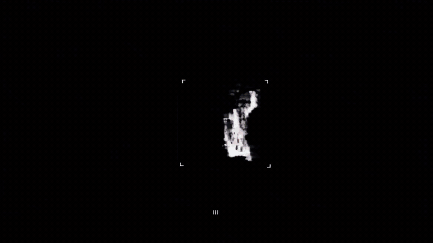
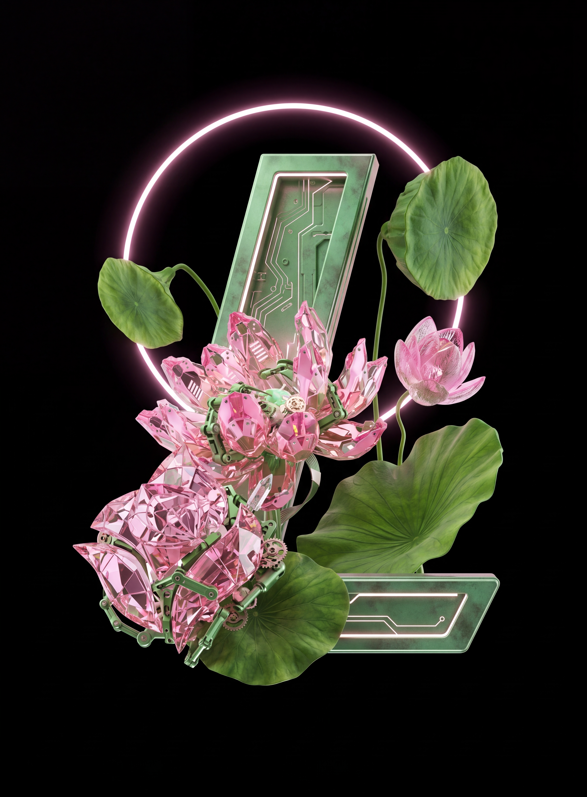
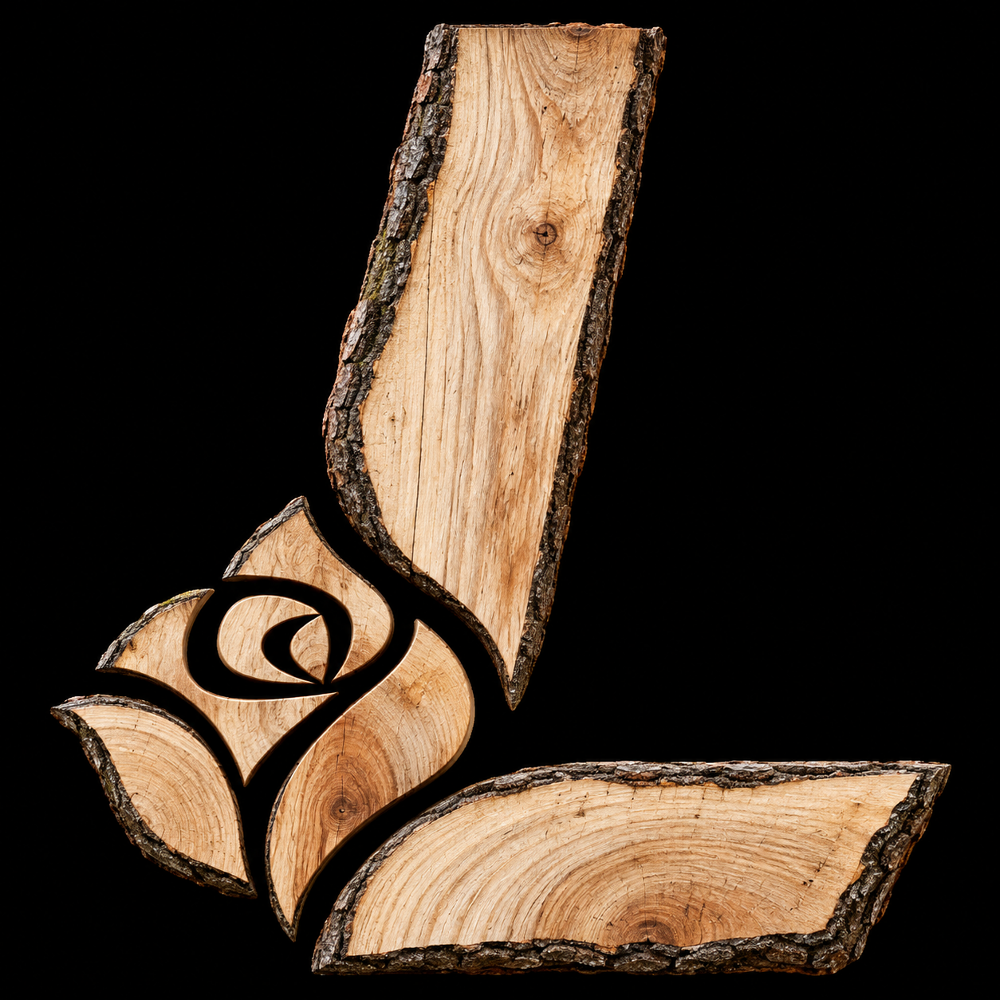

# LSF 网站 Logo 风格切换加载视频

把用户自己的 Logo 转换成 15 套统一构图的先锋材质资产，再生成严格计时、连续切换风格、首尾纯黑的网站加载视频。

> 内置图片只作为材质和灯光参考。实际使用时，Logo 结构始终来自用户自己的 Logo，不复制示例中的 L 形标志或装饰物。

## 效果预览



视频文件：

- [5 秒生成母版 MP4](assets/examples/l-logo-generated-master-5s.mp4)
- [3.2 秒网站交付版 MP4](assets/examples/l-logo-web-delivery-3.2s.mp4)
- [原始节奏参考视频 MP4](assets/video-references/pacing-reference.mp4)

## 部分风格参考

<table>
  <tr>
    <td align="center"><br>红色透明水晶</td>
    <td align="center"><br>机械荷花</td>
    <td align="center"><br>蓝色长绒毛</td>
  </tr>
  <tr>
    <td align="center"><br>原木年轮</td>
    <td align="center"><br>蓝白发光字符</td>
    <td align="center"><br>银色雕花金属</td>
  </tr>
</table>

[查看完整 15 套风格参考](assets/style-references/)

## 工作流程

1. 用户提供自己的 Logo。
2. 将 Logo 分别转换成 15 张同构风格资产。
3. 上传原始 Logo、15 张风格变体和节奏参考视频。
4. 使用 Seedance 2.5 生成 5 秒母版。
5. 根据网站体验派生约 3.2 秒交付版，并以 `object-fit: contain` 无裁切播放。

时间轴固定为：`0–0.5 秒`轮廓出现，`0.5–4.3 秒`材质连续切换，`4.3–5.0 秒`闪回、凝聚并熄灭。

## 调用

```text
$lsf-website-logo-style-switch-loader-video
```

完整执行规则见 [SKILL.md](SKILL.md)。
